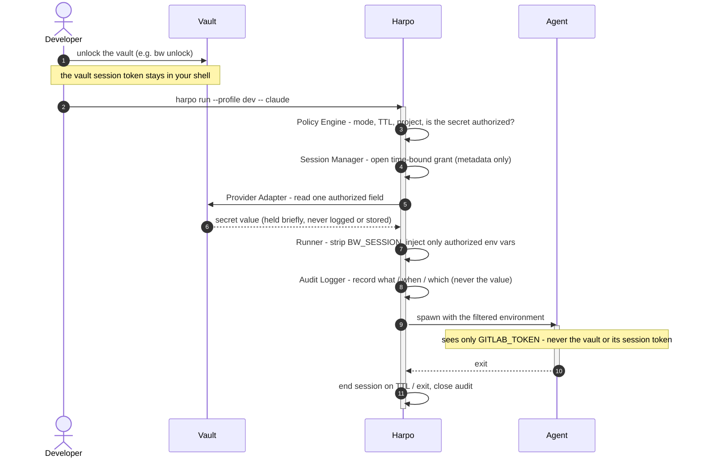
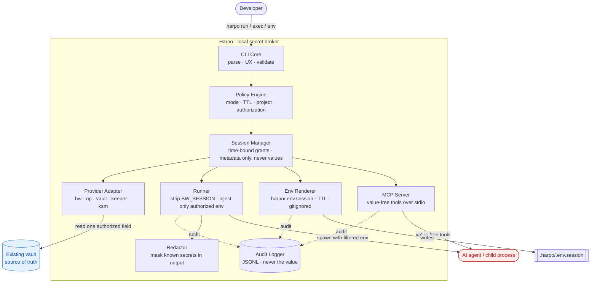

# Harpo

[](https://github.com/AdSoares/harpo/actions/workflows/ci.yml)
[](go.mod)
[](LICENSE)

**A local secret broker for AI coding agents.**

Harpo lets developers grant Claude Code, Codex and other coding agents
**temporary, scoped, auditable** access to credentials from existing vaults -
without pasting tokens into prompts, committing `.env` files, or giving the
agent direct access to the vault.

> The agent never receives vault access. It receives only temporary, limited,
> auditable access to the specific credentials you explicitly authorized.

## Why

AI coding agents can run commands, edit files and call developer tools. But
real work often needs credentials. Pasting secrets into prompts or storing them
in plaintext `.env` files is risky - they leak into history, transcripts,
logs, screenshots and Git.

Harpo keeps your vault as the source of truth and hands agents only the secrets
you authorized, for the current project and session, then audits the use
without ever storing the value.

## Why Harpo, not just my vault?

Some vaults already offer - or will soon offer - agent-oriented access
features. Harpo stays useful and distinct because it is **vault-agnostic**:
it brings access across *different* vaults into one consistent workflow.

If you keep a company vault and a separate personal vault for side projects,
Harpo gives your agents one standard way to use both - same scoping, same TTLs,
same audit - instead of a different mechanism per vault.

## How it works

A single `harpo run` brokers one authorized secret into the agent's
environment - the agent never touches the vault or the vault session token.



## Use cases

- Grant a GitLab token to the current project only.
- Load an AWS credential for a single 2-hour session.
- Render a temporary, git-ignored `.env` for a local environment.
- Launch the agent with env vars already injected - without revealing the values.
- Audit which secrets were used, when, and in what context.

## Example

```bash
bw unlock
harpo run --profile my-project-dev -- claude
```

## Status

Early MVP, under active development. Built in **Go** (decision recorded in
[`docs/adr/ADR-0001-stack-mvp-go.md`](docs/adr/ADR-0001-stack-mvp-go.md)).
Supported providers: **Bitwarden Password Manager** (`bw`), **Keeper Commander**
(`keeper`), **Keeper Secrets Manager** (`ksm`, scoped machine identity),
**1Password** (`op`), and **HashiCorp Vault** (`vault`). The provider layer is
pluggable; planned providers include Bitwarden Secrets Manager, AWS Secrets
Manager, Infisical and Doppler. See [`docs/providers.md`](docs/providers.md).

Specs:

- [`docs/mvp-spec.md`](docs/mvp-spec.md) - what is being built now.
- [`docs/market-ready-spec.md`](docs/market-ready-spec.md) - long-term vision.

## Install (from source)

Requires Go 1.26+.

```bash
go build -o harpo .
./harpo version
```

## Quick start

```bash
harpo init --mode strict --agent claude
harpo provider add bw --type bitwarden-password-manager
harpo secret map gitlab.ad.read \
  --provider bw \
  --ref "gitlab.com | ad | PAT | claude-code | read_api" \
  --field password \
  --env GITLAB_TOKEN
harpo profile create dev --ttl 2h --agent claude
harpo profile add-secret dev gitlab.ad.read
harpo agent setup claude
harpo run --profile dev -- claude
```

## Command surface (MVP)

```
harpo init                      Initialize Harpo in the current project
harpo provider add|status       Manage / probe vault providers
harpo secret map|list|test      Map aliases to vault items (never the value)
harpo profile create|add-secret Manage reusable session profiles
harpo session start|status|list|revoke
harpo run --profile <p> -- ...  Run an agent/command with secrets injected
harpo exec --with a:ENV -- ...  Run one command with specific secrets
harpo unlock|lock [provider]    Unlock a vault / forget its cached session (managed unlock)
harpo mcp --profile <p>         Serve value-free tools to an agent over MCP (stdio)
harpo env render                Write a temporary .env (balanced mode only)
harpo audit list                Inspect the local audit log
harpo agent setup claude|codex  Generate agent-safety config
```

## Architecture

Harpo is a set of local components with a strictly one-directional flow toward
the vault and back into a controlled child-process environment. Config
(`harpo.yml`) is versionable and secret-free; the vault stays the source of
truth; the agent only ever receives an injected env var.



| Component | Responsibility |
|---|---|
| **CLI Core** | Command parsing, interactive UX, validation, error messages. |
| **Policy Engine** | Enforces mode, TTL, project path, allowed destinations, and whether the requested secret is authorized. |
| **Session Manager** | Creates time-bound grants; stores **metadata only**, never secret values. |
| **Provider Adapter** | Pluggable vault interface (`bw`, `op`, `vault`, `keeper`, `ksm`); reads one authorized field, never lists the vault for the agent. |
| **Runner** | Primary delivery path: strips inherited `BW_SESSION`, injects only authorized vars, spawns the agent. |
| **Env Renderer** | Opt-in `.env` materialization under gitignored `.harpo/`, with a TTL (balanced mode). |
| **MCP Server** | Serves value-free tools to an agent over stdio, so the value never enters its environment. |
| **Audit Logger** | Appends JSONL events (what / when / which) - **never the value**. |
| **Redactor** | Masks known secret formats in `harpo exec` output and Harpo's own errors. |

## Security model (summary)

- Harpo does **not** replace your vault.
- Harpo does **not** expose your vault session (`BW_SESSION`) to agents.
- Harpo does **not** print secrets by default.
- Harpo uses temporary session grants with a TTL.
- Harpo writes audit logs **without** secret values.

See [`SECURITY.md`](SECURITY.md) for the threat model and what Harpo does *not*
protect against.

## Documentation

- [Getting started](docs/getting-started.md)
- [Security model](docs/security-model.md) · [Threat model](docs/threat-model.md)
- [Providers](docs/providers.md) · [Policies](docs/policies.md)
- Agents: [Claude Code](docs/agents/claude-code.md) · [Codex](docs/agents/codex.md)
- Specs: [MVP](docs/mvp-spec.md) · [Market-ready](docs/market-ready-spec.md)
- Feature specs: [Managed unlock](docs/specs/managed-unlock.md) · [Proxy / MCP mode](docs/specs/proxy-mcp-mode.md)
- [Near-term roadmap](docs/roadmap.md)

## Contributing

Contributions are welcome - see [`CONTRIBUTING.md`](CONTRIBUTING.md) and our
[Code of Conduct](CODE_OF_CONDUCT.md). Harpo is a security tool, so please read
the security invariants before changing anything that touches secrets.

## License

[Apache-2.0](LICENSE).
